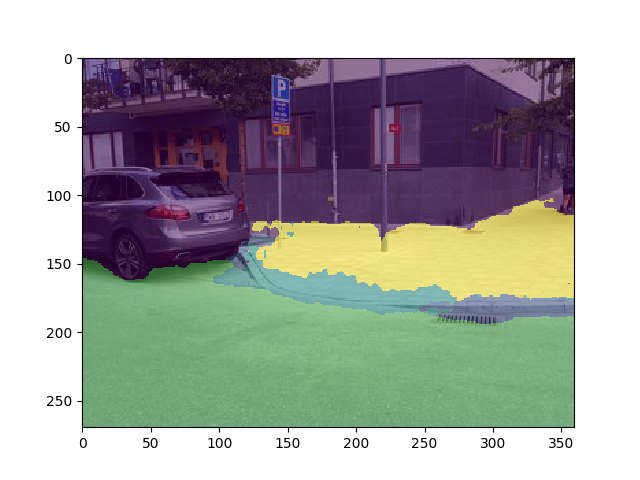

# Bachelor Thesis at Uni Freiburg
This is my bachelor thesis written in latex at the chair for Autonomous Intelligent Systems at Uni Freiburg.

The topic chosen is "Semantic Segmentation of Curbs and Curb Cuts from Street Imagery".
This thesis was completed on September 2, 2019 and presented on October 28, 2019.

In this work, we cover the use of machine learning, specifically convolutional neural networks, as well as the use of a domain specific custom loss function, to segment curbs and curb cuts from street imagery.
We were able to complete this task with reasonable accuracy, given the limitations and obstacles in attempting to perform semantic segmentation on very small features which have very different appearances depending on its environment.
We were also able to show that the method applied can generalize well outside of the training and validation dataset and applied to use on the [Obelix robot](https://europa.informatik.uni-freiburg.de).

The network is able to segment street images as seen here.

Code for this thesis can be found in my [CurbNet repo](https://github.com/yvan674/CurbNet)
